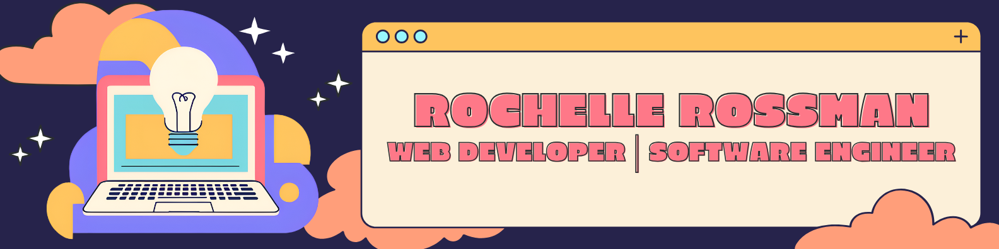

### 👋 I’m Rochelle Rossman

I'm a web software developer with a passion for accessible, inclusive, and user-first digital experiences. I come from a nontraditional background — with over a decade in customer-facing leadership roles — and bring that people-first lens into every part of my dev work. I thrive on collaboration, iteration, and building tools that are actually useful.

---

### 🛠️ Tech Stack

#### Languages, Frameworks & Libraries

#### Styling & UI

#### CMS & Platforms

#### DevOps & Deployment

---

### 📈 GitHub Stats

<table>
  <tr>
    <td width="50%">
      
    </td>
    <td width="50%">
      
    </td>
  </tr>
</table>

---

### 🔗 Connect with Me

